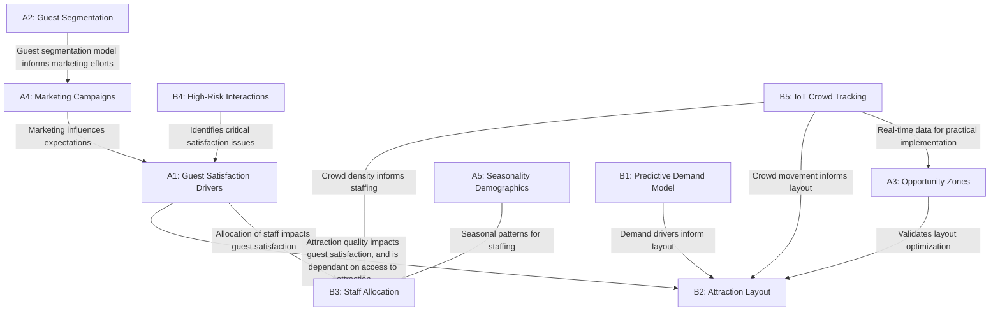

# DSA3101_Group8_Project1

```mermaid
flowchart TD
    A1[A1: Guest Satisfaction Drivers]
    A2[A2: Guest Segmentation]
    A3[A3: Opportunity Zones]
    A4[A4: Marketing Campaigns]
    A5[A5: Seasonality Demographics]
    B1[B1: Predictive Demand Model]
    B2[B2: Attraction Layout]
    B3[B3: Staff Allocation]
    B4[B4: High-Risk Interactions]
    B5[B5: IoT Crowd Tracking]

    %% woah u can comment using this
    A1 -->|"Allocation of staff impacts guest satisfaction"| B3
    A1 -->|"Attraction quality impacts guest satisfaction, and is dependant on access to attraction"| B2
    A3 -->|"Validates layout optimization"| B2
    B5 -->|"Real-time data for practical implementation"| A3
    B4 -->|"Identifies critical satisfaction issues"| A1
    B5 -->|"Crowd movement informs layout"| B2
    B5 -->|"Crowd density informs staffing"| B3
    A5 -->|"Seasonal patterns for staffing"| B3
    A4 -->|"Marketing influences expectations"| A1
    B1 -->|"Demand drivers inform layout"| B2
    A2 -->|"Guest segmentation model informs marketing efforts"| A4

```
