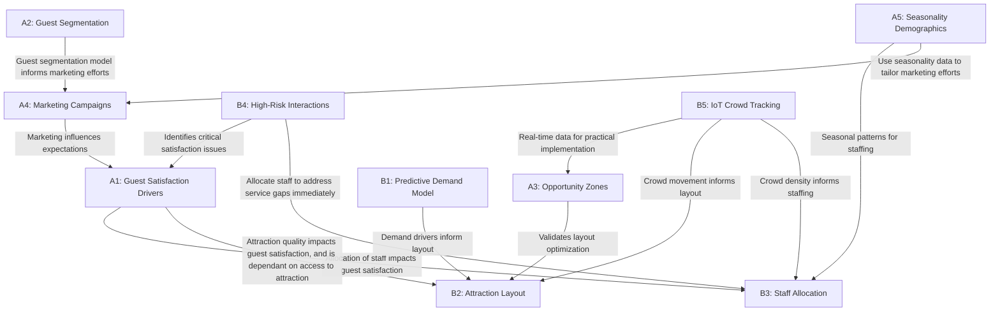

# Theme Park Consulting

The global amusement park industry is surging forward at an impressive 10.55% CAGR, presenting unprecedented opportunities for growth. Behind this growth, there is a complex ecosystem of operations, customer experiences, and business decisions to be tackled.

We've analyzed the industry's pain points and growth opportunities through our advanced data science solutions. Our findings reveal two critical pathways \- to elevate both smiles and bottom lines. For sustainable growth, guest satisfaction and operational efficiency need to be maximised.

Using advanced data science methodologies, we've developed an interconnected insights framework that reveals the various relationships between guest satisfaction and operational excellence. 

This analysis spans ten key business questions divided into two domains: Guest Experience Studies (A1-A5) and Operations Optimization (B1-B5). 

**Click on any of them to learn more:**

# Business Questions

## Guest Experience Studies

### A1 Guest Satisfaction Drivers

*What are the primary factors affecting guest satisfaction across different touchpoints of the Disneyland guest journey?*

Analysed 1,000 reviews from 42,000 entries by using an LLM to identify specific touchpoints in the guest journey and their associated sentiment. Regression lines were then calculated between these touchpoints and overall ratings.

**Key Insights**

1. Attractions quality (r \= 0.21, p \< 0.001) and park atmosphere (r \= 0.20, p \< 0.001) are the most important positive drivers.  
2. Staff interactions (r \= \-0.40, p \< 0.001) and attraction issues (r \= \-0.40, p \< 0.001), have the strongest negative correlations

**Business Impact & Recommendations**

1. Staff Training (r \= \-0.40, p \< 0.001)  
   - Staff issues strongly correlate with poor ratings, necessitating **B3's staff allocation model** to ensure adequate staffing  
2. Attractions Management (Positive: r \= 0.21, Negative: r \= \-0.40, both p \< 0.001)  
   - Attraction experiences significantly impact satisfaction in both directions, making them a key lever \- hence dictating the need for **B2's attraction layout optimization** to strategically position attractions

### A2 Guest Segmentation

*How can we use clustering to uncover distinct guest segments and reveal hidden satisfaction gaps?*

Applied clustering and mismatch analysis on key variables, such as ratings, sentiment, and month. Although 80% of the guests rated highly ( around 4.7/5), notable discrepancies exist between ratings and sentiment. Around 55% show no mismatch, while 9% are extreme “over-raters” \- critical in their review but still giving high ratings (mean mismatch of \+6.23). Vice versa, 23% are “under-raters” (mean mismatch of \-1.22).

**Key insight** 

Even with high overall satisfaction, mismatches between ratings and review sentiment expose underlying issues in specific segments, suggesting that some guests may mask dissatisfaction or express overly critical ratings.

**Business Impact**  

Target these segments with tailored follow-up and surveys, leverage season-specific service improvements, and refine engagement strategies to convert hidden dissatisfaction into loyalty. These segmentation insights also inform **A4's marketing campaign strategies**.

### A3 Opportunity Zones

*Where are the "opportunity zones" in guest journey patterns that can help reduce wait times at high-demand attractions?*

By analyzing 10 years of geo-tagged Flickr photos (2007-2017) at Disney California Adventure, we identified three significant "opportunity zones" within 100 meters of high-traffic attractions that received 88% fewer photos. This pattern persisted across all 17 seasons, indicating structural rather than seasonal factors.

**Key Insight** 

Many/Numerous attractions nearby popular ones remain consistently unexplored, creating opportunity zones. In the future, **B5's IoT crowd tracking** will validate these zones in real-time, presenting untapped opportunities for guests to be redirected.

**Business Impact** 

Activating these opportunity gaps could effectively distribute crowds, reduce guest travel time, and increase overall satisfaction. These findings directly support **B2's attraction layout optimization** by identifying specific underutilized areas that could be developed. These areas could be used for new attractions, photo spots, or themed installations that complement (rather than duplicate) nearby popular attractions.

### A4 Marketing Campaign

*What techniques can we use to increase theme park visitors?*

By conducting campaign lift analysis with k-means on monthly average crowd levels before and after campaigns, we identified marketing efforts that boost theme park interest. Subsequently, topic modelling was used to extract key trends from popular campaigns, identifying elements that make them successful.

**Key Insight** 

Marketing campaigns featuring popular movies boost theme park visitor numbers. For instance, the Tron Light Cycle Run 2023 campaign, promoting the 2010 film Tron: Legacy, led to a 50% increase in visitors the next month. This suggests that aligning marketing with current trends effectively enhances theme park popularity. Campaigns should be customized to guest segments identified in **A2’s** clustering analysis for optimal results.

**Business Impact** 

To maximize revenue, businesses should monitor monthly visitor numbers to assess theme obsolescence. If necessary, they can incorporate themes from popular movies or music to enhance theme park appeal. These campaigns impact visitor expectations, influencing **A1’s** satisfaction drivers.

### A5 Seasonality Demographics

*How does seasonality, public holidays and visitor demographics impact theme park attendance and reviews?*

Used graphical analysis to track attendance trends and reviews across time-periods and guest segments. Conducted statistical tests to assess differing holiday attendance.

**Key Insight** 

Attendance peaks on holidays, especially Christmas and New Year's, and is highest on Saturdays. Families and general visitors attend more during summer and winter breaks. Guests from Europe, North America and those travelling with families tend to give the most reviews. Ratings positively correlate with future attendance.

**Business Impact and Recommendation** 

Implement dynamic pricing, fast passes, and increase staffing on peak days. These seasonal attendance patterns directly inform **B3's staff allocation optimization** to ensure adequate coverage during high-demand periods. The demographic insights feed into **A4's marketing campaign development**, enabling targeted approaches for different visitor groups.

## Operations Optimization

### B1 Predictive Demand Model

*How can a predictive model be used to identify key demand drivers for theme park attractions, and guide data-driven decisions for park operators?*

A Random Forest model developed using data on weather, public holidays, natural disasters, park incidents, night shows, and local theme park competition was used to produce a feature importance table listing predictors according to their relative importance in predicting attraction demand.

**Key Insights**

The top 3 predictors were all attractions, suggesting that the appeal of these rides overshadow other external factors in driving attraction demand. Adverse weather conditions, while less influential, remained important in prediction.

**Business Impact** 

Operators can use the model's insights to boost demand by enhancing top-ranking attractions, installing shelters near weather-sensitive areas, and adjusting staffing based on forecasted conditions. The model's identification of key demand drivers directly informs **B2's attraction layout optimization**, ensuring high-demand attractions are strategically positioned. Additionally, the predictive capabilities support **B3's staff allocation planning** by anticipating demand fluctuations.

### B2 Attraction Layout

*How can we optimize the layout of a theme park to increase customer retention?*

Using queue theory, agent-based modelling and reinforcement learning, the model optimises the placement of rides within a grid. Considerations have been made towards minimizing customer dissatisfaction, steps between attractions and the density of people, while maximising the space between highly attractive rides.

**Key insights** 

As the grids and layouts are not fixed, the output models have high variance. This implies that there are many ways to optimize placement allowing us to customize layouts to fit the vision of the business. The layout strategies directly address **A1's findings on attraction quality** as a key satisfaction driver, focusing on reducing frustration points.

**Recommendations**

To increase guest satisfaction, ensure less popular rides are near more popular rides, giving guests more options in ride choices. This strategy leverages **A3's opportunity zones** by strategically activating underutilized areas near popular attractions. Ensure that the spread of popular rides are evenly distributed so as to reduce crowding. **B5's IoT crowd tracking** can validate these layout decisions with real-time data.

### B3 Staff Allocation

*How can we optimize staff allocation in a theme park at any given time while minimizing overall staffing levels?*

Staff are allocated dynamically based on guest demand. Using convex optimization, the number of staff allocated to a service per hour is minimised while still meeting demand. The final output is a bar plot showing optimized hourly staffing for a given day.

**Key Insights**

Hourly variations have the greatest impact on staff allocation, as their multipliers show the widest range. Monthly and daily trends are next, followed by public holidays. 

Meanwhile, rain has the least influence on attendance and demand surges are highest on weekends, especially Saturdays, and on public holidays.

**Recommendation**

Dynamically allocate staff to meet guest demand, addressing **A1's findings on staff interactions** as a critical satisfaction driver.The optimization model can also identify underutilized attractions during low-demand periods. **B5's IoT crowd tracking** can provide real-time crowd density data to dynamically adjust staffing needs throughout the day.

### B4 High Risk Interactions

*How can we promptly address high-risk interactions to improve guest experience?*

Disneyland reviews were classified on a 1–5 star scale. This was used to fine-tune a DistilBERT-based classifier to identify new high-risk reviews. Topic modelling was then performed to uncover recurring issues in the negative reviews.

**Key Insight** 

High-risk reviews are centered around long wait times, overcrowding, and closed attractions. Additionally, cultural and language differences, particularly in Hong Kong Disneyland, were noted as factors that negatively impacted the guest experience. These findings directly support **A1's pain point analysis**.

**Business Impact** 

This capability allows theme park operators to automatically analyze new reviews and flag high-risk interactions in real-time. Common pain points across guest experiences can be uncovered, empowering operators to implement targeted improvements. **B3's staff allocation** works in conjunction to address service gaps quickly.

### B5 IoT Crowd Tracking

*How can WiFi access points be used to improve guest experience?*

Random forest regression was applied on WiFi signal strength to visualize crowd movements and patterns, allowing predictions on users’ movements over time.

**Key insight** 

WiFi access point signal strength can be reliably used to map the positions of unique IPs. Models can also be trained to predict the movement of crowds based on carefully selected parameters. This real-time data validates **A3's opportunity zones** findings by confirming actual guest movement patterns.

**Recommendation** 

By leveraging WiFi to gather crowd data, theme parks can visualize and understand how people move. The movement data directly informs **B2's layout optimization** strategies by providing empirical evidence of how guests navigate between attractions. Additionally, crowd density information supports **B3's staff allocation** by identifying where and when additional staff are needed most.

# Insights and Business Impacts

Our findings demonstrate that improvements in operational efficiency directly enhance guest experiences, while a deeper understanding of guest preferences optimises resource allocation, resulting in a virtuous cycle that drives both visitor satisfaction and business performance.

- The strongest negative correlations with guest satisfaction are staff interactions and attraction issues, highlighting critical intervention points (which we later come to tackle).

- Despite high overall ratings, we uncovered significant mismatches between numeric ratings and sentiment, exposing hidden satisfaction gaps.

- Identifying opportunity zones (underutilized areas near popular attractions) presents substantial potential for crowd redistribution and enhanced guest flow.

- Our predictive demand model demonstrates that specific attractions are stronger demand drivers, emphasizing the importance of strategic attraction placement.

- IoT-based crowd tracking provides real-time validation of guest movement patterns, creating a feedback loop that continuously refines operational strategies.

These interconnected insights then come together to enable theme park operators to implement data-driven improvements across all touchpoints of the guest journey.

# Recommendations

We recommend implementing a multi-faceted approach that leverages the interconnections identified in our analysis.

1. Prioritize staff training and allocation based on predictive models, ensuring adequate coverage during peak periods identified through seasonality analysis.  
2. Strategically activate opportunity zones near popular attractions with experiences (like photo opportunities or themed installations) to better distribute crowds.  
3. Develop targeted marketing campaigns that align with identified guest segments and seasonal patterns, taking into account the recommendations made  
4. Implement IoT-based real-time crowd tracking to dynamically adjust staffing and services throughout the day.  
5. Implement our automated high-risk interaction detecting model from guest feedback, enabling immediate service recovery interventions.  
6. Refine attraction layouts based on our optimization models to minimize walking distances while maximizing ride access.

# Conclusion

Our analysis reveals a fundamental truth: in theme parks, guest satisfaction and operational excellence are two sides of the same coin. By implementing our interconnected recommendations, operators can create a self-reinforcing ecosystem where improvements in one area naturally enhance outcomes in related domains.

To sustain this cycle, we recommend establishing an integrated data platform that combines real-time IoT tracking, guest feedback, and operational metrics. This foundation will allow the models presented here to evolve continuously, adapting to changing guest preferences and operational realities.

Ultimately, we are in the business of fun. Behind every data point is a family making memories. The parks that will thrive tomorrow are those that use data today, not just to fill seats and maximize revenue, but to orchestrate joy. Those who master this will write the next chapter of this industry's remarkable story.  

