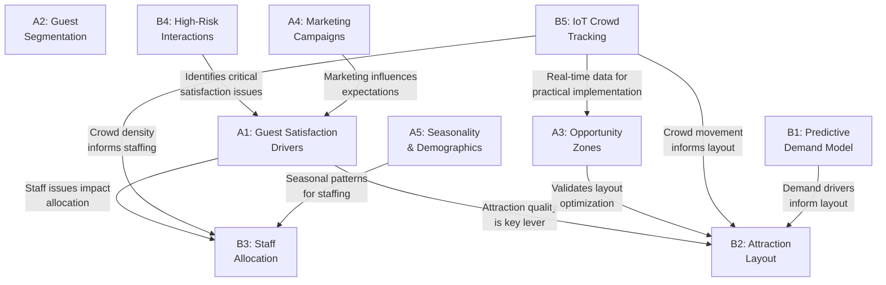

# DSA3101_Group8_Project1

```mermaid
flowchart TD
    A1[A1: Guest Satisfaction\nDrivers]
    A2[A2: Guest\nSegmentation]
    A3[A3: Opportunity\nZones]
    A4[A4: Marketing\nCampaigns]
    A5[A5: Seasonality\n& Demographics]
    B1[B1: Predictive\nDemand Model]
    B2[B2: Attraction\nLayout]
    B3[B3: Staff\nAllocation]
    B4[B4: High-Risk\nInteractions]
    B5[B5: IoT Crowd\nTracking]

    %% woah u can comment using this
    A1 -->|"Staff issues impact\nallocation"| B3
    A1 -->|"Attraction quality\nis key lever"| B2
    A3 -->|"Validates layout\noptimization"| B2
    B5 -->|"Real-time data for\npractical implementation"| A3
    B4 -->|"Identifies critical\nsatisfaction issues"| A1
    B5 -->|"Crowd movement\ninforms layout"| B2
    B5 -->|"Crowd density\ninforms staffing"| B3
    A5 -->|"Seasonal patterns\nfor staffing"| B3
    A4 -->|"Marketing influences\nexpectations"| A1
    B1 -->|"Demand drivers\ninform layout"| B2

```
