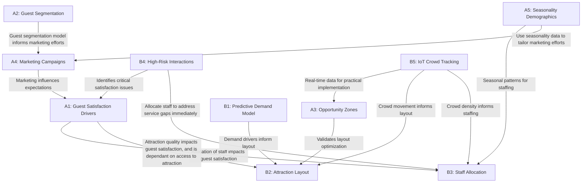

# Theme Park Strategies

The global amusement park industry is surging forward at an impressive 10.55% CAGR, presenting unprecedented opportunities for growth. However, we know that there is a complex ecosystem of operations, customer experiences, and business decisions to be tackled.

We've analyzed the industry's pain points and growth opportunities through our advanced data science solutions. Our findings reveal two critical pathways \- to elevate both smiles and bottom lines. That is, for sustainable growth, guest satisfaction and operational efficiency need to be maximised.

Using advanced data science methodologies we've developed an interconnected insights framework that reveals the symbiotic relationship between guest satisfaction and operational excellence.

This analysis spans ten key business questions divided into two domains: Guest Experience Studies (A1-A5) and Operations Optimization (B1-B5)

# Business Questions

## Guest Experience Studies

### A1 Guest Satisfaction Drivers

*What are the primary drivers of guest satisfaction across different touchpoints of the Disneyland guest journey, and how can these insights be leveraged to improve overall guest experience?*

We analyzed 1,000 randomly selected reviews from a dataset of over 42,000 entries. Each review was coded using an LLM to identify specific touchpoints in the guest journey and their associated sentiment. We then calculated Pearson correlation coefficients between these touchpoints and overall ratings.

**Key Insights**

1. Attractions quality (r \= 0.21, p \< 0.001) and park atmosphere (r \= 0.20, p \< 0.001) are the most important positive drivers.  
2. Staff interactions (r \= \-0.40, p \< 0.001) and attractions issues (r \= \-0.40, p \< 0.001), have the strongest negative correlations

**Business Impact & Recommendations**

1. Staff Training (r \= \-0.40, p \< 0.001)  
   - Staff issues strongly correlate with poor ratings, necessitating **B3's staff allocation model** to ensure adequate staffing  
2. Attractions Management (Positive: r \= 0.21, Negative: r \= \-0.40, both p \< 0.001)  
   - Attraction experiences significantly impact satisfaction in both directions, making them a key lever \- hence dictating the need for **B2's attraction layout optimization** work to strategically position attractions

### A2 Guest Segmentation

*How can we use clustering to uncover distinct guest segments and reveal hidden satisfaction gaps?*

**A**pplied clustering and mismatch analysis on key variables, such as ratings, sentiment, and month. We found that although 80% of the guests rate highly (averaging around 4.7), notable discrepancies exist between ratings and sentiment. Around 55% show no mismatch, while 9% are extreme “over-raters” \- critical in their review but still give high ratings (mean mismatch of \+6.23). Vice versa, 23% are “under-raters” (mean mismatch of \-1.22). The rest form a moderate over-rating group.

**Key insight** Even with high overall satisfaction, mismatch between numeric ratings and review sentiment expose underlying issues in specific segments, suggesting that some guests may mask dissatisfaction or express overly critical ratings.

**Business Impact**  Target these segments with tailored follow-up and surveys, leverage season-specific service improvements, and refine engagement strategies to convert hidden dissatisfaction into loyalty. These segmentation insights also inform **A4's marketing campaign strategies**.

### A3 Opportunity Zones

*Where are the "opportunity zones" in guest journey patterns that can help reduce wait times at high-demand attractions?*

By analyzing 10 years of geo-tagged Flickr photos (2007-2017) at Disney California Adventure, we identified three significant "opportunity zones" within 100 meters of high-traffic attractions that received 88% fewer photos. This pattern persisted across all 17 seasons, indicating structural rather than seasonal factors.

**Key Insight** Substantial attractions nearby popular ones remain consistently unexplored, creating opportunity zones. In the future, **B5's IoT crowd tracking** will validate these zones in real-time, confirming where guests actually go versus where they could be directed.

**Business Impact** Activating these opportunity gaps could distribute crowds more effectively, reduce guest travel time, and increase overall satisfaction. These findings directly support **B2's attraction layout optimization** by identifying specific underutilized areas that could be developed. These areas could be used for new attractions, photo spots, or themed installations that complement (rather than duplicate) nearby popular attractions.

### A4 Marketing Campaign

*What campaign techniques can we use to increase the number of visitors in theme parks?*

By using trend analysis on the monthly average crowd level and total visitors to theme parks, we identified marketing efforts that have led to increased interest. Afterwards, word topic analysis coupled with clustering obtained key trends from popular campaigns to identify what makes campaigns great.

**Key Insight** Marketing efforts that incorporated popular movies or music garnered more visitors to theme parks for at least 6 months post-campaign. This indicates that marketing that follows new popular trends is a strong predictor of theme park popularity. These campaigns should be tailored to the guest segments identified in **A2's clustering analysis** for maximum impact.

**Business Impact** To maximize revenue, the business should first follow monthly visitor numbers to check for theme obsolescence. If so, businesses can then extract themes from popular movies/music to amplify the appeal of theme parks in the new period. These campaigns directly influence visitor expectations, showing up on **A1's satisfaction drivers**.

### A5 Seasonality Demographics

*How does seasonality, public holidays and visitor demographics impact theme park attendance and reviews?*

**Analysis** Used graphical analysis to track attendance trends and reviews across time periods and guest segments. Conducted statistical tests to assess holiday attendance difference.

**Key Insight** Attendance peaks on holidays, especially Christmas and New Year's, and is highest on Saturdays. Families and general visitors attend more during summer and winter breaks. Guests from Europe, North America and those travelling with families tend to give the most reviews. Ratings positively correlate with future attendance.

**Business Impact and Recommendation** Implement dynamic pricing, fast passes, and increase staffing on peak days. These seasonal attendance patterns directly inform **B3's staff allocation optimization** to ensure adequate coverage during high-demand periods. The demographic insights feed into **A4's marketing campaign development**, enabling targeted approaches for different visitor groups.

## Operations Optimization

### B1 Predictive Demand Model

*How can a predictive model be used to identify key demand drivers for theme park attractions and services, and guide data-driven decisions for park operators?*

We developed a Random Forest model using data on weather, public holidays, natural disasters, park incidents, night shows, and competition from other local theme parks. This model was then used to predict attraction demands.

The top 3 predictors in the importance table were 3 different attractions, suggesting the inherent appeal of these rides may overshadow other external factors in driving attraction demand. Adverse weather conditions, while less influential, remained important variables in predicting attraction demand.

**Business Impact** Theme Park operators can use the model's insights to boost demand by enhancing attractions with dominating feature importances, installing shelters near weather-sensitive areas, and adjusting staffing based on forecasted conditions. The model's identification of key demand drivers directly informs **B2's attraction layout optimization**, ensuring high-demand attractions are strategically positioned. Additionally, the predictive capabilities support **B3's staff allocation planning** by anticipating demand fluctuations.

### B2 Attraction Layout

*How can we optimize the layout of a theme park to increase customer retention?*

Using queue theory, agent based modelling and reinforcement learning, our model optimises the placement of rides within a grid. Considerations have been made towards minimizing customer dissatisfaction, steps between attractions and the density of people, while maximising the space between highly attractive rides.

**Key insights** As the grids and layouts are not fixed, the output models have high variance. This implies that there are many ways to optimize placement allowing us to customize layouts to fit the vision of the business. The layout strategies directly address **A1's findings on attraction quality** as a key satisfaction driver, focusing on reducing frustration points.

**Recommendations:** To increase guests satisfaction, ensure less popular rides are near more popular rides, giving guests more options in ride choices. This strategy leverages **A3's opportunity zones** by strategically activating underutilized areas near popular attractions. Ensure that the spread of popular rides are evenly distributed so as to reduce crowding. **B5's IoT crowd tracking** can validate these layout decisions with real-time data on how guests actually move through the space, enabling continuous refinement.

### B3 Staff Allocation

*How can we optimize staff allocation in a theme park at any given time while minimizing overall staffing levels?*

Our basis for staff allocation ties closely on guest demand. Using convex optimization, we minimize the number of staff allocated to a service at any given hour, while meeting demand. The final output is a bar plot showing optimized hourly staffing for a given day, considering factors like public holidays and weather forecasts.

**Key Insights** Hourly variations have the greatest impact on staff allocation. Monthly and daily trends have the next greatest impact, followed by public holidays. Demand surges are highest on weekends, especially Saturdays, and on public holidays.

**Recommendation** Increase staffing on weekends and public holidays to accommodate higher demand, directly addressing **A1's findings on staff interactions** as a critical satisfaction driver. The seasonal staffing approach aligns with **A5's seasonality insights** to ensure coverage during peak periods. Staff should also be allocated to reallocate staff within a day to meet shifting demands across different roles in a day. **B5's IoT crowd tracking** can provide real-time crowd density data to dynamically adjust staffing needs throughout the day.

### B4 High Risk Interactions

*How can we promptly address high-risk interactions to improve guest experience?*

Using Disneyland reviews, we applied a sentiment analysis model to classify reviews on a 1–5 star scale. Reviews rated 1–2 stars were labelled as high risk. These were then used to fine-tune a classifier to identify new high-risk reviews. Thereafter, topic modelling uncovered recurring issues in the negative reviews, enabling scalable identification of guest dissatisfaction.

**Key Insight** High-risk reviews are centered around long wait times, overcrowding, and closed attractions, which lead to comparisons between Disneyland locations. Additionally, cultural and language differences, particularly in Hong Kong Disneyland, were noted as factors that negatively impacted the guest experience, especially for international visitors. These findings directly support **A1's pain point analysis**.

**Business Impact** This capability allows theme park operators to automatically analyze new reviews and flag high-risk interactions in real-time. Topic modelling uncovers common pain points across guest experiences, enabling management to prioritize and implement targeted improvements where they matter most. The real-time identification of emerging issues creates a feedback loop with **B3's staff allocation** to address service gaps quickly.

### B5 IoT Crowd Tracking

*How can we leverage data from IoT technology to enhance guest experience?*

We applied random forest regression on WiFi signal strength to visualize crowd movements and patterns with heatmaps. By applying regression and classification models, we can predict the movements of users over time.

**Key insight** WiFi access point signal strength can be used as a reliable method to map the positions of unique IPs. Models can also be trained to predict the movement of crowds based on a variety of parameters in addition to signal strength across WiFi access points. This real-time data validates **A3's opportunity zones** findings by confirming actual guest movement patterns.

**Recommendation** By leveraging WiFi to gather crowd data, a theme park can better visualize and understand how people move. The movement data directly informs **B2's layout optimization** strategies by providing empirical evidence of how guests navigate between attractions. Additionally, crowd density information supports **B3's staff allocation** by identifying where and when additional staff are needed most.

# 

# Insights and Business Impacts

Our findings demonstrate that improvements in operational efficiency directly enhance guest experiences, while deeper understanding of guest preferences enables more effective resource allocation, resulting in a virtuous cycle that drives both visitor satisfaction and business performance.

- The strongest negative correlations with guest satisfaction are staff interactions and attraction issues, highlighting critical intervention points (which we later come to tackle).

- Despite high overall ratings, we uncovered significant mismatches between numeric ratings and sentiment, exposing hidden satisfaction gaps.

- The identification of opportunity zones (underutilized areas near popular attractions) presents substantial potential for crowd redistribution and enhanced guest flow.

- Our predictive demand model demonstrates that specific attractions are stronger demand drivers, emphasizing the importance of strategic attraction placement.

- IoT-based crowd tracking provides real-time validation of guest movement patterns, creating a feedback loop that continuously refines operational strategies.

These interconnected insights then come together to enable theme park operators to implement data-driven improvements across all touchpoints of the guest journey.

# 

# Recommendations

We recommend implementing a multi-faceted approach that leverages the interconnections identified in our analysis.

1. Prioritize staff training and allocation based on predictive models, ensuring adequate coverage during peak periods identified through seasonality analysis.  
2. Strategically activate opportunity zones near popular attractions with experiences (like photo opportunities or themed installations) to better distribute crowds.  
3. Develop targeted marketing campaigns that align with identified guest segments and seasonal patterns, taking into account the recommendations made  
4. Implement IoT-based real-time crowd tracking to dynamically adjust staffing and services throughout the day.  
5. Implement our automated high-risk interaction detecting model from guest feedback, enabling immediate service recovery interventions.  
6. Refine attraction layouts based on our optimization models to minimize walking distances while maximizing ride access.

# 

# Conclusions

Our analysis reveals a fundamental truth: in theme parks, guest delight and operational excellence are two sides of the same coin. By implementing our interconnected recommendations, operators can create a self-reinforcing ecosystem where improvements in one area naturally enhance outcomes in related domains.

To sustain this virtuous cycle, we recommend establishing an integrated data platform that combines real-time IoT tracking, guest feedback, and operational metrics. This foundation will allow the models presented here to evolve continuously, adapting to changing guest preferences and operational realities.

Ultimately, we are in the business of fun. Behind every data point is a family making memories. The parks that will thrive tomorrow are those that use data today not just to fill seats and maximize revenue, but to orchestrate joy. Those who master this will write the next chapter of this industry's remarkable story.  
